# satellite-coverage-tracker
***
COP3530 Data Structures &amp; Algorithm - Project 3

**Group Name:** The Orbital Police

**Group Members:** Kamarii Austin, Ryan McGlinn, Brandon Rosenthal

# Start Here
***

# Class Documentation
***
The following section provides a summary of each custom class used in the project

## SatelliteCoverageTracker
***
This is the main class for this project and is used to run the process.

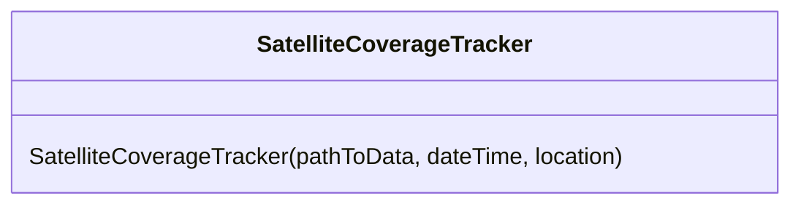

### Construction
- `SatelliteCoverageTracker()` - A constructor which takes in the path to the data directory, a date time to test for observations, and a location to filter the observations

## SatelliteCatalog
***
This class helps manage satellite catalog information so a satellite catalog number from a TLE observation can be correlated.

### Structs
- `CatalogEntry` - A public struct that contains attributes associated with a catalog entry 

### Enums
- `RCS_Size` - An emum that is used to define the radar cross-section for the satellite

### Construction
- `SatelliteCatalog()` - a constructor that takes in the path to the data directory where the catalog CSV can be found

### Accessors
- `getCatalogEntry` - returns a reference to a `CatalogEntry` for a given satellite catalog number
- `count()` - returns the count of catalog entries in the catalog

## TLEParser Class
***
This is a class which wraps certain methods exposed by the libsgp4 library to parse and get the geodetic location for a two line element

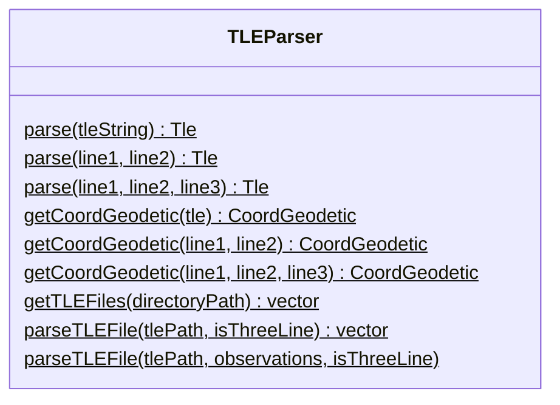

### Static Methods
- `parse(tleString)` - Takes in a string that contains newline characters to separate the three lines and returns a `Tle` object
- `parse(line1, line2)` - Takes in two strings representing the primary data lines (omitting the optional name line) and returns a `Tle` object
- `parse(line1, line2, line3)` - Takes in three strings representing a line that contains the name and the two primary data lines and returns a `Tle` object
- `getCoordGeodetic(tle)` - Takes in a `Tle` object and returns a `CoordGeodetic` object representing the position of the object at the time of observation
- `getCoordGeodetic(line1, line2)` - Takes in two strings representing the primary data lines and omits the optional name line and returns a `CoordGeodetic` object representing the position of the object at the time of observation
- `getCoordGeodetic(line1, line2, line2)`- Takes in three strings representing the name and the two primary data lines and returns a `CoordGeodetic` object representing the position of the object at the time of observation
- `getTLEFiles()` - Returns the paths to the file that have the .tle extension at the passed directory
- `parseTLEFile()` - Processes a .tle file and returns a vector of `Tle` objects
- - `parseTLEFile()` - Processes a .tle file and inserts `Tle` objects into the vector passed to the function

## Data Ingestion
Feature uses  `TLEParser` and `SatelliteCoverageTracker` classes to load and process satellite data from TLE files.

### Usage
1. Place your TLE files in the `data/` directory.
2. Run the main program to parse and ingest the TLE data.

## DataModel Class
***
This is a template class which both the LinearModel and GraphModel classes inherit from.

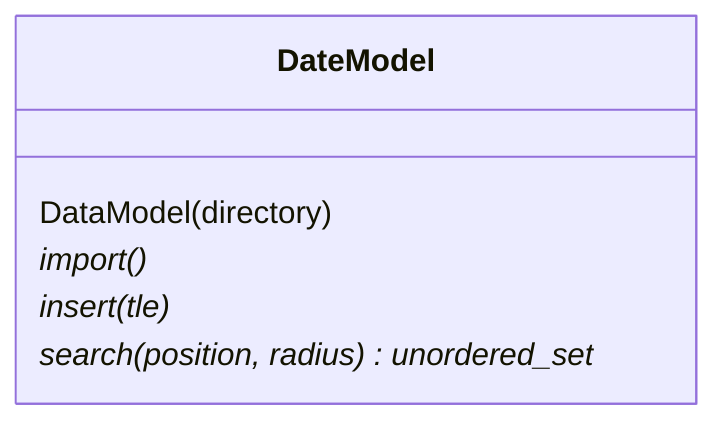

### Construction
- `DataModel(directory)` - a constructor that takes in a path to the directory where the data files are located

### Pure Virtual Functions
- `import()` - performs the data import process
- `insert(tle)` - takes in a reference to a `Tle` object and inserts it into the data structure
- `search(position, radius)` - takes in a position and a radius used to perform the search for matching data points

## GraphModel Class
***
A class that represents Tle observations in a Graph data structure and supports a method to search for observations that passed over a given position within a radius of that position

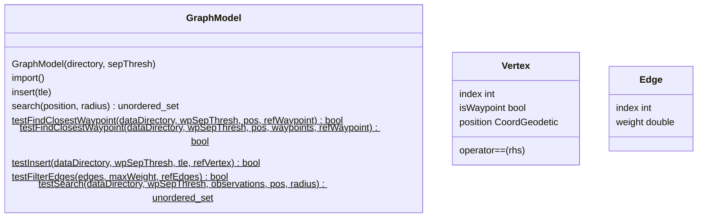

### Structs
- `Vertex` - A public struct that represent a node or vertex in the graph
- `Edge` - A public struct that represents a connection between vertices in the graph

### Construction
- `GraphModel(directory, sepThresh)` - constructor that takes in a path to the data directory and a waypoint separation threshold

### Mutators
- `import()` - Performs the import process for all .tle files found in the data directory
- `insert()` - Inserts a single data point into the data structure

### Accessors
- `search(position, radius)` - performs a search of the data structure to find datapoint that are in range relative to a position

### Static Tests
- `testFindClosestWaypoint()` - Takes in a position, checks the positions and inserts a waypoint because one does not exist, then compares the waypoint to a reference
- `testFindClosestWaypoint()` - Takes in a position and a vector of waypoints, and compares the closes waypoint to a reference waypoint
- `testInsert()` - Tests inserting a two line element into the Graph and compares the Vertex that was generated to a reference vertex
- `testFilterEdges()` - Tests the `_filterByWeight()` function which filters a vector of edges to return the vertices index whose weight (distance) is below the max weight
- `testSearch()` - Tests the `search()` function which searches for observations that occurred within range of a position during the observation period

## LinearModel Class
***
A class that represents TLE observations in a simple map structure. It supports the public methods outlined in the DataModel class.

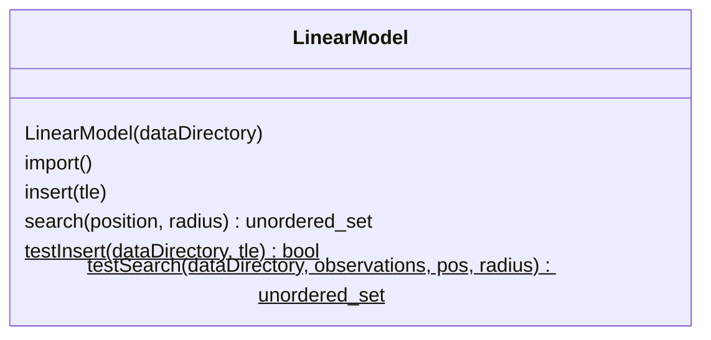

### Construction
- `LinearModel()` - A constructor that takes in a string representing the path to the data directory

### Mutators
- `import()` - Inserts all the observations found in all the .tle files in the data directory
- `insert(tle)` - Inserts an observation into the data structure

### Accessors
- `search(position, radius)` - Returns observations that were within the radius of a given position at the time of observation

### Static Tests
- `testInsert(dataDirectory, tle)` - Tests the `insert()` method for the `LinearModel` class
- `testSearch()` - Tests the `search()` function for the `LinearModel` class

## Utility Class
***
A utility class that contains some common helpfully functions that are used throughout the project

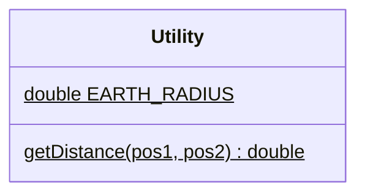

### Static Methods
- `getDistance(pos1, pos2)` - computes the haversine distance (in kilometers) between two geodetic coordinate positions

# Library Documentation
***
The following section describes external libraries that are used in this project

## libsgp4
This library is a C++ implementation of SGP4 (Simplified General Perturbations), which is a model that predicts the position of an object based on an initial observation. We make use of the following classes to convert two-line element (TLE) data to determine the position of an object when it was observed:

- `SGP4`
- `CoordGeodetic`
- `Tle`
- `Eci`
- `DateTime`

### SGP4 Class
This is the main class for the library which utilizes the SGP model to determine and predict the position of objects based on an orbital observation.

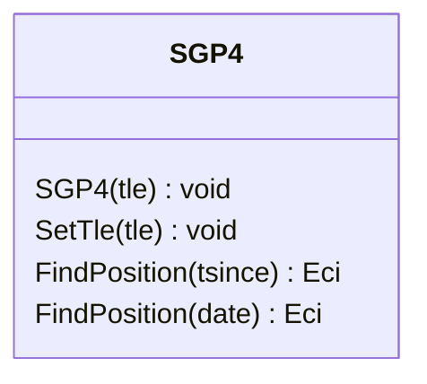
- `SGP4()` - Constructor, initializes the model with to a specific observation with the TLE passed to the constructor
- `SetTle()` - Updates the model to use a new observation based on the TLE passed to the func
- `FindPosition(tsince)` - Finds the position relative to a time since the TLE observation
- `FindPosition(date)` - Finds the position relative to a DateTime object passed to the function

### CoordGeodetic Class
This class represents a geodetic coordinate position in space based on a longitude, latitude and altitude.

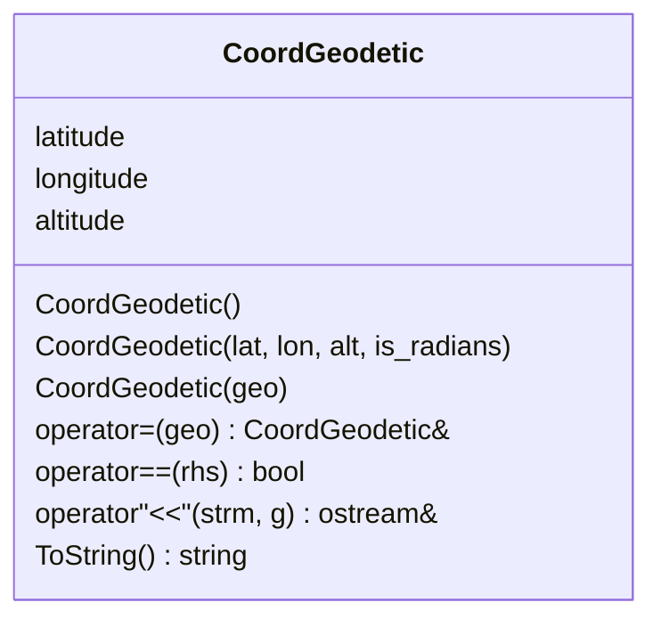
- `CoordGeodetic()` - Default constructor
- `CoordGeodetic(lat, long, alt, is_radians)` - Constructor to create a `CoordGeodetic` object from latitude, longitude, altitude and if the latitude/longitude are in degrees or radians
- `CoordGeodetic(geo)` - Constructor to create a `CoordGeodetic` object from another `CoordGeodetic` object
- `operator=(geo)` - Assignment operator
- `operator==(rhs)` - Equality operator that returns true if the latitude, longitude and altitude are identical
- `operator<<(strm, g)` - Insertion operator overload that outputs a formatted string
- `ToString()` - Returns a string containing the latitude, longitude and altitude that is meant to be displayed

### Tle Class
This class takes in TLE data and splits it into it's components do it can be used by other processes.

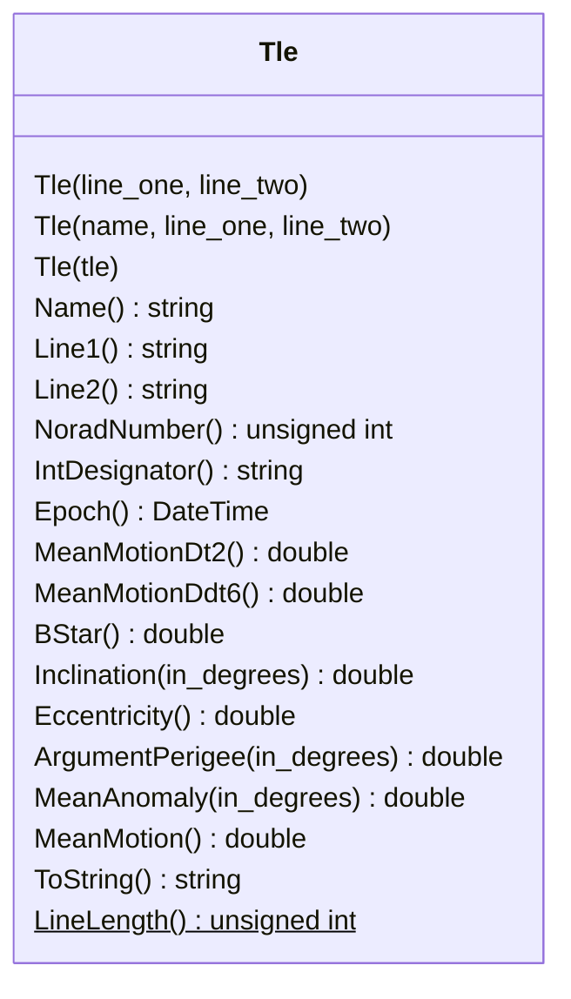

### Eci Class
This class represents an Earth-centered inertial position for a particular time

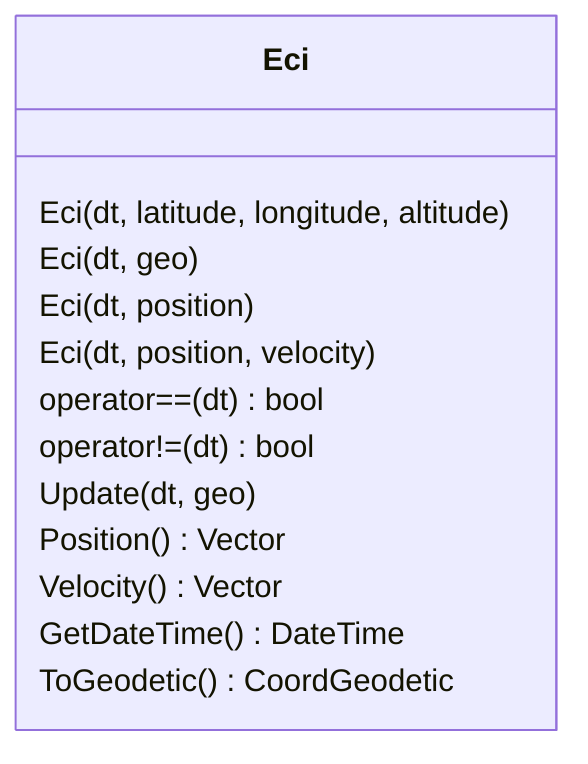

### DateTime Class
This class is used to represent the date and time in other classes in the SGP4 library

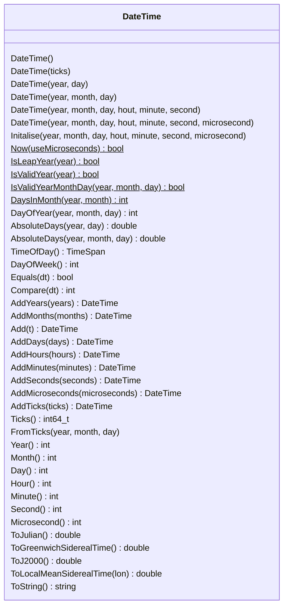