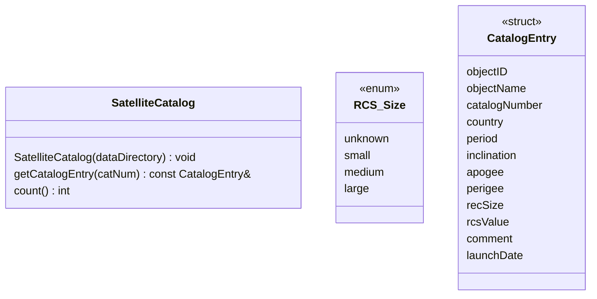
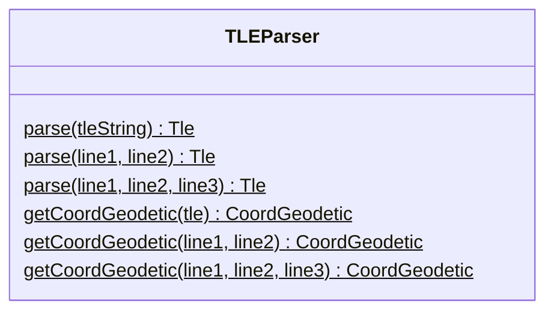
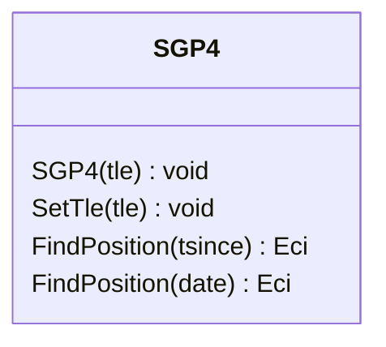
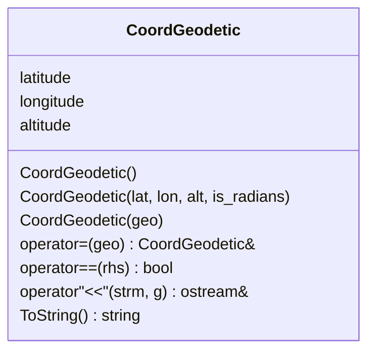
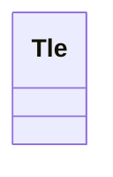
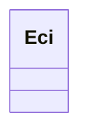
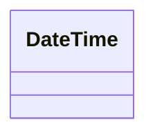

# satellite-coverage-tracker
***
COP3530 Data Structures &amp; Algorithm - Project 3

**Group Name:** The Orbital Police

**Group Members:** Kamarii Austin, Ryan McGlinn, Brandon Rosenthal

# Start Here
***

# Class Documentation
***
The following section provides a summary of each custom class used in the project

## SatelliteCoverageTracker

## SatelliteCatalog
***
This class helps manage satellite catalog information so a satellite catalog number from a TLE observation can be correlated.

### Construction
- `SatelliteCatalog()` - a constructor that takes in the path to the data directory where the catalog CSV can be found

### Accessors
- `getCatalogEntry` - returns a reference to a `CatalogEntry` for a given satellite catalog number
- `count()` - returns the count of catalog entries in the catalog

## TLEParser Class
***
This is a class which wraps certain methods exposed by the libsgp4 library to parse and get the geodetic location for a two line element

## DataModel Class
***
This is a template class which both the LinearModel and GraphModel classes inherit from.

### Construction
- `DataModel()` - a constructor that takes in a path to the directory where the data files are located

### Pure Virtual Functions
- `import()` - performs the data import process
- `insert()` - takes in a reference to a Tle object and inserts it into the data structure
- `search()` - takes in a position and a radius used to perform the search for matching data points

## GraphModel Class
***
### Construction
- `GraphModel()` - constructor that takes in a path to the data directory and a waypoint separation threshold

### Mutators
- `import()` - Performs the import process for all .tle files found in the data directory
- `insert()` - Inserts a single data point into the data structure

### Accessors
- `search()` - performs a search of the data structure to find datapoint that are in range relative to a position

### Static Tests
- `testFindClosestWaypoint()` - Takes in a position, checks the positions and inserts a waypoint because one does not exist, then compares the waypoint to a reference
- `testFindClosestWaypoint()` - Takes in a position and and a vector of waypoints, and compares the closes waypoint to a reference waypoint
- `testInsert()` - Tests inserting a two line element into the Graph and compares the Vertex that was generated to a reference vertex

## LinearModel Class

## Utility Class
- `getDistance()` - computes the haversine distance between two geodetic coordinate positions

# Library Documentation
***
The following section describes external libraries that are used in this project

## libsgp4
This library is a C++ implementation of SGP4 (Simplified General Perturbations), which is a model that predicts the position of an object based on an initial observation. We make use of the following classes to convert two-line element (TLE) data to determine the position of an object when it was observed:

- `SGP4`
- `CoordGeodetic`
- `Tle`
- `Eci`
- `DateTime`

### SGP4 Class
This is the main class for the library which utilizes the SGP model to determine and predict the position of objects based on an orbital observation.

- `SGP4()` - Constructor, initializes the model with to a specific observation with the TLE passed to the constructor
- `SetTle()` - Updates the model to use a new observation based on the TLE passed to the func
- `FindPosition(tsince)` - Finds the position relative to a time since the TLE observation
- `FindPosition(date)` - Finds the position relative to a DateTime object passed to the function

### CoordGeodetic Class
This class represents a geodetic coordinate position in space based on a longitude, latitude and altitude.

- `CoordGeodetic()` - Default constructor
- `CoordGeodetic(lat, long, alt, is_radians)` - Constructor to create a `CoordGeodetic` object from latitude, longitude, altitude and if the latitude/longitude are in degrees or radians
- `CoordGeodetic(geo)` - Constructor to create a `CoordGeodetic` object from another `CoordGeodetic` object
- `operator=(geo)` - Assignment operator
- `operator==(rhs)` - Equality operator that returns true if the latitude, longitude and altitude are identical
- `operator<<(strm, g)` - Insertion operator overload that outputs a formatted string
- `ToString()` - Returns a string containing the latitude, longitude and altitude that is meant to be displayed

### Tle Class
This class takes in TLE data and splits it into it's components do it can be used by other processes.

### Eci Class

### DateTime Class

